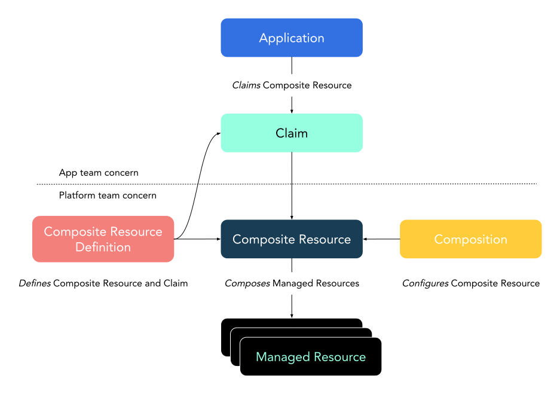

# Crossplane
The aim of this repository is to test  crossplane and create set of resources to remember in the future how it works.

## How it works

## Install crossplane
```bash
kubectl create namespace crossplane-system
helm repo add crossplane-stable <https://charts.crossplane.io/stable>
helm repo update

helm install crossplane --namespace crossplane-system crossplane-stable/crossplane
````
### Configure credentials

Create a file `credentials.txt`:

```yaml
[default]
aws_access_key_id = <aws_access_key>
aws_secret_access_key = <aws_secret_key>
```

```bash
kubectl create secret \
generic aws-secret \
-n crossplane-system \
--from-file=creds=./credentials.txt
```
### Install provider AWS

You have two options, [oficial crossplane](https://marketplace.upbound.io/providers/upbound/provider-aws/v0.18.0) or [aws contrib](https://marketplace.upbound.io/providers/crossplane-contrib/provider-aws/v0.36.1)
```bash
cat <<EOF | kubectl apply -f -
apiVersion: pkg.crossplane.io/v1
kind: Provider
metadata:
  name: provider-aws
spec:
  package: xpkg.upbound.io/crossplane-contrib/provider-aws:v0.33.0
EOF
```

```bash 
cat <<EOF | kubectl apply -f -
apiVersion: aws.crossplane.io/v1beta1
kind: ProviderConfig
metadata:
  name: provider-config-aws
spec:
  credentials:
    secretRef:
      namespace: crossplane-system
      name: aws-secret
      key: creds
    source: Secret
  endpoint:
    url:
      dynamic:
        host: amazonaws.com
        protocol: https
      type: Dynamic
EOF
```
### Notes
01. Create composition
02. Create the CRD (a.k.a XRD) that using prior composition `1`
03. Create the XMR using composition `1` and XRD `2` (non namespaced)
04. Create another XMR using composition `1` and XRD `2` (non namespaced)
05. Create claim using composition `1` and XRD `2` (namespaced)
07. Create composition with parameters
08. Create claim using composition `7` and XRD `2` (namespaced)
09. Create composition with parameters and labels
10. Create claim using composition `9` and XRD `2` (namespaced) with proper label --> works
11. Create claim using composition `9` and XRD `2` (namespaced) with no proper label --> doesn't work
12. Create claim using composition `9` and XRD `2` (namespaced) without labels --> works


20. Import DynamoDB table already exists in AWS
21. Import S3 table already exists in AWS


30. Create isolated DynamoDB table MR
31. Create isolated S3 MR

## Documentation
* [AWS Crossplane on EKS](https://github.com/awslabs/crossplane-on-eks.git)
* [Crossplane first look](https://blog.upbound.io/crossplane-first-look/)


## Useful commands
```bash
k get composite -A #get all composites (resource created throught composition)
```